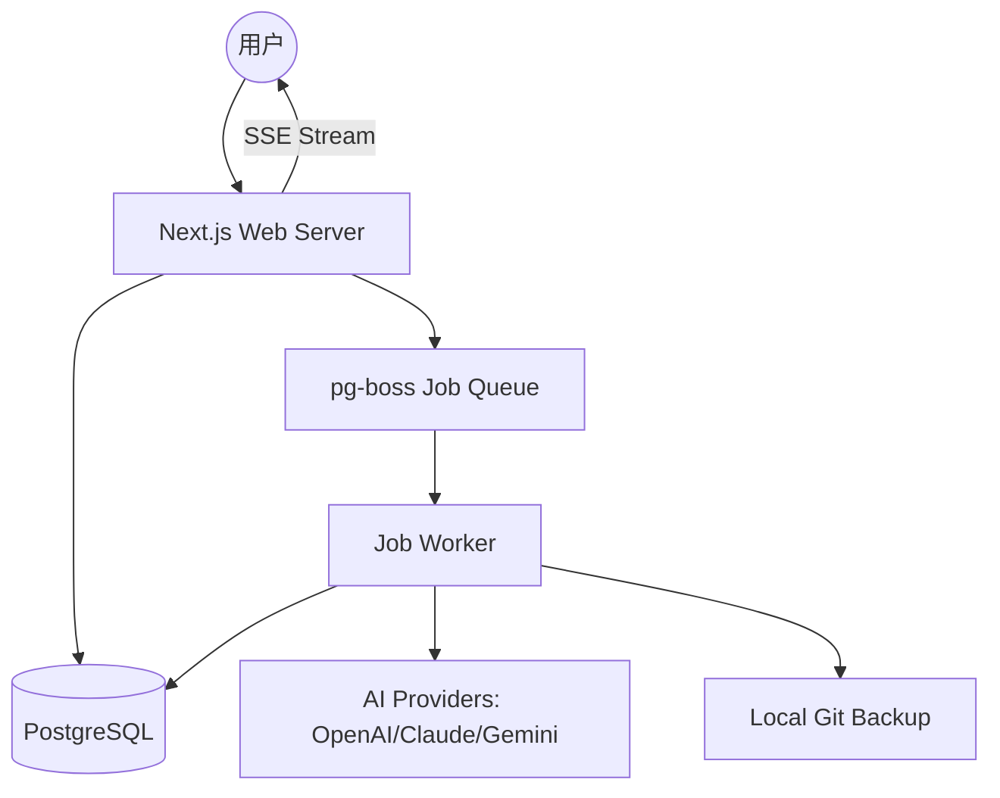

# 🌌 aiWriter - 智能小说创作辅助平台

<p align="center">
  
</p>

<p align="center">
  <a href="https://nextjs.org/"></a>
  <a href="https://react.dev/"></a>
  <a href="https://www.typescriptlang.org/"></a>
  <a href="https://www.prisma.io/"></a>
  <a href="https://www.postgresql.org/"></a>
</p>

<p align="center">
  <b>打破卡文魔咒，重塑创作流。专为中文网文作家打造的 AI 协作工作台。</b>
</p>

---

## 📖 目录
- [项目简介](#项目简介)
- [🛠️ 核心特性](#-核心特性)
- [🖼️ 界面预览](#️-界面预览)
- [🤖 支持的 AI 模型](#-支持的-ai-model)
- [🚀 快速开始](#-快速开始)
- [⚙️ 配置指南](#️-配置指南)
- [📡 API 概览](#-api-概览)
- [🏗️ 系统架构](#️-系统架构)
- [👨‍💻 开发指南](#-开发指南)
- [🛣️ 路线图](#️-路线图)
- [🤝 贡献指南](#-贡献指南)
- [❓ 常见问题 (FAQ)](#-常见问题-faq)
- [📄 许可证](#-许可证)

---

## 项目简介

**aiWriter** 是一款专为中文网络小说作家设计的 AI 辅助创作平台。它通过深度集成大语言模型，并结合专业的网文创作工作流，帮助作者从灵感构思到正文创作，再到质量评审和后期润色，实现全方位的 AI 协作。

不同于通用的 AI 助手，aiWriter 深度理解网文的**节奏、套路、人设一致性**以及**长篇连贯性**，是职业网文作家的数字副驾驶。

---

## ✨ 核心特性

### 🤖 智能 AI Agent 矩阵
系统内置了七大针对网文创作深度优化的 AI 代理：
- ✍️ **章节写手 (Chapter Writer)**：基于大纲、前情和设定，自动生成引人入胜的正文。
- ⚖️ **章节评审 (Reviewer)**：从情节、节奏、人物等 9 个维度进行专业打分和毒点检查。
- ✨ **去 AI 化润色 (Humanizer)**：消除 AI 腔，提升文笔张力，使内容更具人文气息。
- 🧠 **记忆提取器 (Memory Extractor)**：自动提取新设定与剧情进展，确保持续连贯。
- 🔍 **一致性检查 (Consistency Checker)**：严格核对人物、境界等设定，防止逻辑漏洞。
- 💬 **角色对话 (Character Chat)**：沉浸式扮演小说角色，测试人设，挖掘深度剧情。
- 🗺️ **大纲生成器 (Outline Generator)**：快速构建包含主线、伏笔、爽点的完整大纲。

### 🛠️ 职业创作工具
- **多分支章节生成**：支持同时生成多个不同走向的分支，择优而从。
- **设定集 (Lorebook) 系统**：关键词触发式设定注入，确保 AI 严格遵循世界观。
- **角色关系图**：基于 Cytoscape.js 的可视化动态关系图谱。
- **版本控制与备份**：Git 级自动备份，支持修改差异对比 (Diff) 与一键回滚。
- **素材管理库**：结构化管理人物、地理、力量体系等核心创作素材。

---

## 🖼️ 界面预览

> [!TIP]
> 这里的截图仅为占位符，您可以上传实际的软件界面截图。

| 创作中心 (Editor) | 角色关系图 (Graph) |
| :--- | :--- |
|  |  |

**建议添加的截图：**
- **Dashboard**: 项目全局概览
- **Lorebook**: 设定集管理界面
- **Agent Settings**: AI 代理配置页面
- **Review Report**: 章节评审报告

---

## 🤖 支持的 AI 模型

aiWriter 支持多种主流 AI 模型服务商，并针对中文创作进行了特别优化：

| 模型提供商 | 支持型号 | 特色功能 |
| :--- | :--- | :--- |
| **OpenAI** | GPT-4, GPT-4o, GPT-3.5 | 极高的逻辑能力，支持 Responses API 联网搜索 |
| **Anthropic** | Claude 3.5 Sonnet, Claude 3 Opus | 优秀的文学素养，更自然的内容生成 |
| **Google Gemini** | Gemini 2.0/1.5 Pro/Flash | 极长的上下文支持，内置 Google 搜索增强 |
| **Azure OpenAI** | 企业级模型部署 | 满足企业级并发与安全需求 |
| **自定义 API** | 任何兼容 OpenAI 格式的接口 | 支持本地自建模型 (如 DeepSeek, Llama) |

---

## 🚀 快速开始

### 📦 推荐部署：Docker (预构建镜像)

使用 GitHub Container Registry 提供的预构建多架构镜像 (AMD64/ARM64)：

```bash
# 克隆仓库获取配置文件
git clone https://github.com/wmsyw/aiWriter.git
cd aiWriter

# 生成环境配置
npm run setup
# 或手动复制: cp .env.example .env 并编辑

# 使用预构建镜像启动 (推荐)
docker-compose up -d

# 访问 http://localhost:3000/setup 完成初始化
```

**统一镜像架构：**

aiWriter 使用单一 Docker 镜像同时支持 Web 服务和后台任务处理，通过 `APP_MODE` 环境变量切换：

| 模式 | 环境变量 | 说明 |
| :--- | :--- | :--- |
| Web 服务 | `APP_MODE=web` | Next.js 服务器 (默认) |
| 后台 Worker | `APP_MODE=worker` | pg-boss 任务处理 |

```bash
# 镜像地址
ghcr.io/wmsyw/aiwriter:latest

# 指定版本
IMAGE_TAG=v1.0.0 docker-compose up -d
```

### 🔧 本地构建部署

如需本地构建镜像（开发或自定义修改）：

```bash
# 使用本地构建的 compose 文件
docker-compose -f docker-compose.dev.yml up -d --build
```

### 🛠️ 本地开发
1. **安装依赖**:
   ```bash
   npm install
   ```
2. **自动生成环境配置** (推荐):
   ```bash
   npm run setup
   ```
   脚本会自动生成所有必需的密钥并写入 `.env` 文件，同时格式化输出配置内容。
   
   选项: `--force` 覆盖已存在的配置 | `--dry-run` 仅预览不写入 | `--minimal` 只生成必需项
3. **数据库初始化**:
   ```bash
   npx prisma db push
   ```
4. **启动服务**:
   ```bash
   npm run dev:all
   ```

---

## ⚙️ 配置指南

### 🔑 环境变量
| 变量名 | 必填 | 说明 |
| :--- | :--- | :--- |
| `DATABASE_URL` | 是 | PostgreSQL 连接字符串 |
| `APP_ENCRYPTION_KEY_B64` | 是 | 32 字节 Base64 加密密钥，用于加密 AI API Key |
| `SESSION_SECRET` | 是 | 用于 Session 加密的随机字符串 |
| `ADMIN_SETUP_TOKEN` | 是 | 首次运行时的安装授权令牌 |
| `GIT_BACKUP_ENABLED` | 否 | 是否启用 Git 自动备份 |

### 🤖 AI 代理配置
在 Web 界面中，您可以为每个 AI Agent 单独配置：
- **模型服务商**: 选择使用的 API。
- **提示词模板**: 支持使用 [LiquidJS](https://liquidjs.com/) 语法的自定义模板。
- **模型参数**: 如 Temperature, Top P, Max Tokens 等。

---

## 📡 API 概览

aiWriter 为开发者提供了丰富的接口，方便进行自动化集成或二次开发：

### 核心接口 (RESTful)
- `GET /api/novels`: 获取当前用户的所有小说列表。
- `POST /api/novels/[id]/chapters`: 为指定小说创建新章节。
- `GET /api/novels/[id]/character-graph`: 获取角色关系图谱数据。
- `POST /api/agents`: 触发指定的 AI Agent 任务。
- `GET /api/jobs/[id]`: 查询异步任务状态。

### 实时流 (SSE)
- `GET /api/jobs/stream`: 通过服务器发送事件 (SSE) 实时获取任务进度反馈。

---

## 🏗️ 系统架构

aiWriter 采用 Web Server + Worker 的异步架构，确保长篇内容生成时的系统响应速度。



- **Web Server**: 负责 UI 渲染、权限管理与 API 路由。
- **Worker**: 负责耗时的 AI 生成、Git 备份、大文件处理等异步任务。
- **Job Queue**: 基于 PostgreSQL 的高性能任务队列。

---

## 👨‍💻 开发指南

### 如何添加新的 AI 代理 (Agent)
1. 在 `prisma/schema.prisma` 中查看 `AgentDefinition` 模型。
2. 在 UI 的“代理管理”页面添加新定义，或在 `src/server/services/agents.ts` 中注册内置代理。
3. 在 `src/server/services/templates.ts` 中定义相应的 Prompt 模板。

### 自定义 Prompt 模板
系统使用 [LiquidJS](https://liquidjs.com/)。您可以在模板中使用以下上下文变量：
- `{{novel_title}}`: 小说标题
- `{{previous_summary}}`: 前情提要
- `{{characters}}`: 注入的角色设定

### 添加新的 AI 服务商
1. 修改 `src/server/adapters/providers.ts`。
2. 实现 `ProviderAdapter` 接口中的 `generate` 方法。
3. 在 `PROVIDER_BASE_URLS` 中添加默认端点。

### 代码规范
- 使用 **TypeScript** 进行强类型约束。
- 前端组件遵循 **React 19** 的最佳实践。
- 样式使用 **TailwindCSS 4**。

---

## 🛣️ 路线图

- [ ] **多用户协作**: 支持工作室模式下的多人共同创作。
- [ ] **移动端应用**: 适配手机端，随时随地记录灵感。
- [ ] **插件系统**: 支持第三方插件扩展创作功能。
- [ ] **多格式导出**: 支持导出为 EPUB, PDF, Word, 以及直接同步至发布平台。
- [ ] **深度知识库 (RAG)**：支持上传整本参考书作为创作背景。

---

## 🤝 贡献指南

我们非常欢迎社区的贡献！
1. **Fork** 本项目。
2. **创建特性分支** (`git checkout -b feature/AmazingFeature`)。
3. **提交更改** (`git commit -m 'Add some AmazingFeature'`)。
4. **推送到分支** (`git push origin feature/AmazingFeature`)。
5. **发起 Pull Request**。

请确保遵循项目的代码规范，并为新功能编写必要的测试用例。

---

## ❓ 常见问题 (FAQ)

**Q: 是否支持本地运行的 LLM (如 DeepSeek)?**
A: 支持。只要您的本地服务提供兼容 OpenAI 的 API 接口，即可在配置中填写自定义 Base URL 和 API Key 进行使用。

**Q: 创作的数据安全吗？**
A: 您的作品内容存储在您自己的数据库中，且支持自动 Git 本地备份。AI 接口的 API Key 在数据库中经过 256 位加密存储。

**Q: 需要支付费用吗？**
A: 本系统本身是开源免费的，但使用闭源 AI 模型（如 GPT-4）需要您自行承担模型服务商收取的 API 费用。

---

## 📄 许可证

本项目遵循 [MIT License](LICENSE) 协议。

---

<p align="center">
  Made with ❤️ for Writers
</p>
