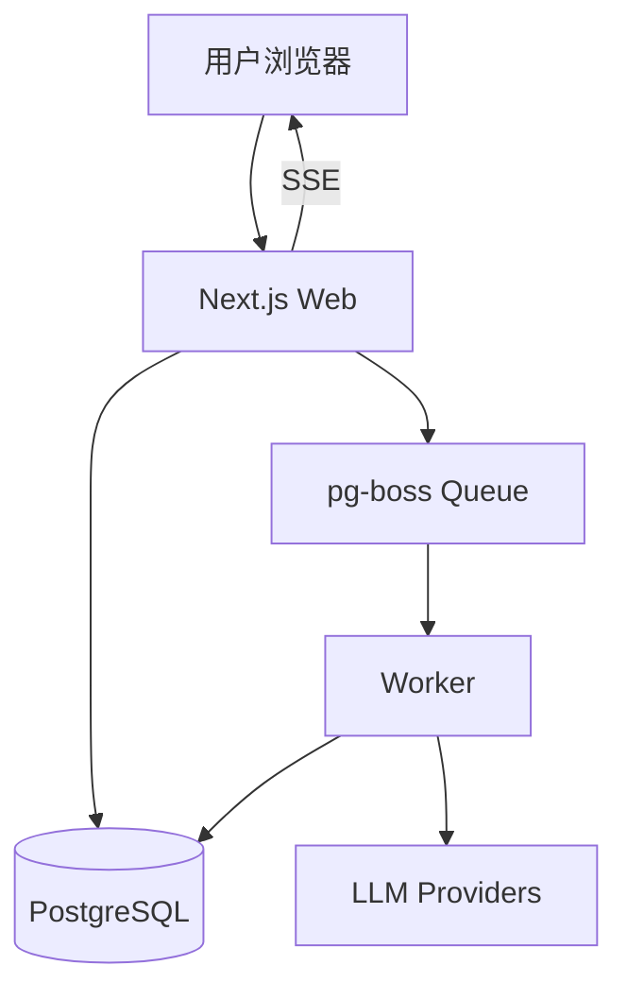

# aiWriter

aiWriter 是一个面向中文长篇创作的 AI 协作平台，提供从设定、纲要、章节生成到评审与资料管理的一体化工作流。

- 前端：Next.js 16 + React 19 + Tailwind CSS 4
- 后端：Next.js Route Handlers + Prisma
- 数据库：PostgreSQL
- 异步任务：pg-boss + 独立 Worker

> 当前版本以桌面端为主（小屏设备会被引导使用桌面端）。

---

## 目录

- [功能概览](#功能概览)
- [快速开始](#快速开始)
- [环境变量](#环境变量)
- [常用命令](#常用命令)
- [项目结构](#项目结构)
- [系统架构](#系统架构)
- [API 概览](#api-概览)
- [运维与排障](#运维与排障)
- [FAQ](#faq)
- [贡献与许可](#贡献与许可)

---

## 功能概览

### 1. 创作工作流
- 小说创建与分步引导（题材、世界观、角色等）
- 大纲/细纲生成、章节生成与多分支探索
- 章节评审与反馈闭环

### 2. Agent 能力
- 内置写作、评审、工具类 Agent（支持模板与参数配置）
- 可按服务商/模型配置运行参数（温度、max tokens 等）

### 3. 资料与设定管理
- 材料库（角色、地点、组织、道具等）
- 钩子（Hooks）与待处理实体（Pending Entities）
- 关系图谱可视化（Cytoscape）

### 4. 异步任务与可观测性
- 通过 pg-boss 处理耗时任务
- 提供任务列表与 SSE 实时更新
- 健康检查接口：`/api/health`

---

## 快速开始

### 方式 A：Docker（推荐）

适合快速体验或部署。

1. 克隆项目

```bash
git clone https://github.com/wmsyw/aiWriter.git
cd aiWriter
```

2. 生成 `.env`

```bash
npm run setup
```

3. 启动服务（数据库 + Web + Worker）

```bash
docker-compose up -d
```

4. 首次初始化管理员

- 打开 `http://localhost:<APP_PORT>/setup`（`APP_PORT` 来自 `.env`）
- 使用 `.env` 里的 `ADMIN_SETUP_TOKEN` 完成初始化

说明：
- `web` 与 `worker` 使用同一镜像，通过 `APP_MODE` 区分运行模式
- 容器启动时 `web` 会执行 `prisma db push`

---

### 方式 B：本地开发

### 前置要求
- Node.js 20+
- PostgreSQL 16+

### 步骤

1. 安装依赖

```bash
npm install
```

2. 生成环境变量

```bash
npm run setup
```

3. 启动数据库（任选一种）

- 使用你本地已有 PostgreSQL
- 或仅启动 compose 的数据库：

```bash
docker-compose up -d db
```

4. 同步数据库结构

```bash
npx prisma db push
```

5. 启动 Web + Worker

```bash
npm run dev:all
```

6. 访问应用

- 默认地址通常为 `http://localhost:<APP_PORT>`（由 `npm run setup` 生成）

---

## 环境变量

`npm run setup` 会自动生成配置，下面是关键项：

| 变量名 | 必填 | 说明 |
| --- | --- | --- |
| `DATABASE_URL` | 是 | PostgreSQL 连接串 |
| `APP_ENCRYPTION_KEY_B64` | 是 | 32 字节 Base64 密钥（用于敏感信息加密） |
| `SESSION_SECRET` | 是 | Session 加密密钥 |
| `ADMIN_SETUP_TOKEN` | 是 | 首次初始化令牌 |
| `POSTGRES_PORT` | 推荐 | Docker 数据库映射端口 |
| `APP_PORT` | 推荐 | Web 服务端口 |
| `POSTGRES_PASSWORD` | 推荐 | Docker 数据库密码 |
| `SMTP_HOST` / `SMTP_USER` / `SMTP_PASS` | 否 | 用于忘记密码邮件 |
| `GIT_BACKUP_ENABLED` | 否 | 是否启用 Git 自动备份 |

> 生产环境请务必替换自动生成的密钥，并妥善保存。

---

## 常用命令

```bash
# 开发
npm run dev          # 仅 Web
npm run worker       # 仅 Worker
npm run dev:all      # Web + Worker

# 质量
npm run lint         # TypeScript 类型检查
npm run test         # Vitest

# 构建与运行
npm run build
npm run start
```

---

## 项目结构

```text
app/                 Next.js App Router 页面与 API 路由
  (dashboard)/       主业务页面
  api/               后端接口
  components/        前端组件
src/
  server/            服务层、任务编排、适配器、中间件
  constants/         常量与内置 Agent 定义
worker/              后台任务处理入口与处理器
prisma/              数据模型（schema.prisma）
scripts/             工具脚本（如 setup-env.js）
tests/               Vitest 测试
```

---

## 系统架构



---

## API 概览

常用接口示例（非完整列表）：

- `GET /api/novels`：获取小说列表
- `POST /api/novels/[novelId]/chapters`：创建章节
- `GET /api/jobs`：获取任务列表
- `GET /api/jobs/stream`：SSE 任务流
- `GET /api/providers`：获取模型服务商配置
- `PUT /api/user/preferences`：更新用户偏好

---

## 运维与排障

### 健康检查

```bash
curl http://localhost:3000/api/health
```

返回内容包含：
- `database`：数据库可用性与延迟
- `queue`：任务队列状态
- `pipelines`：近期执行成功/失败情况

### 常见问题排查

1. 页面空白或初始化失败
- 检查 `.env` 是否存在且关键字段完整
- 检查 `DATABASE_URL` 是否可连接

2. 任务不执行
- 检查 Worker 是否在运行（`npm run worker` 或 compose `worker` 服务）
- 检查 `/api/health` 中 `queue` 状态

3. 忘记密码邮件收不到
- 检查 SMTP 配置是否完整
- 检查发件服务是否允许当前账号发送

---

## FAQ

### 支持本地模型或第三方网关吗？
支持。可使用兼容 OpenAI API 格式的自定义服务。

### 支持移动端吗？
当前主要面向桌面创作场景，移动端体验受限。

### 初始化令牌在哪看？
查看 `.env` 中的 `ADMIN_SETUP_TOKEN`。

---

## 贡献与许可

欢迎提交 Issue / PR 改进项目。

- 建议流程：Fork -> 新分支 -> 提交 -> PR
- 提交前建议执行：`npm run lint && npm run test`

本项目基于 [MIT License](LICENSE)。
